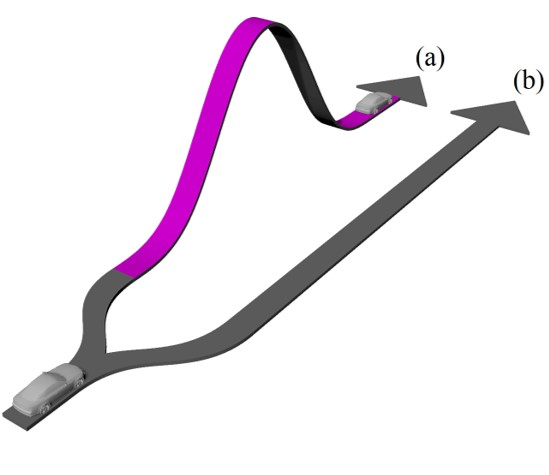
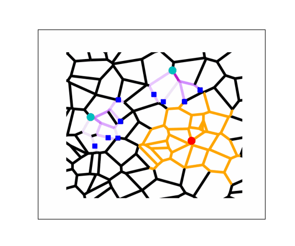
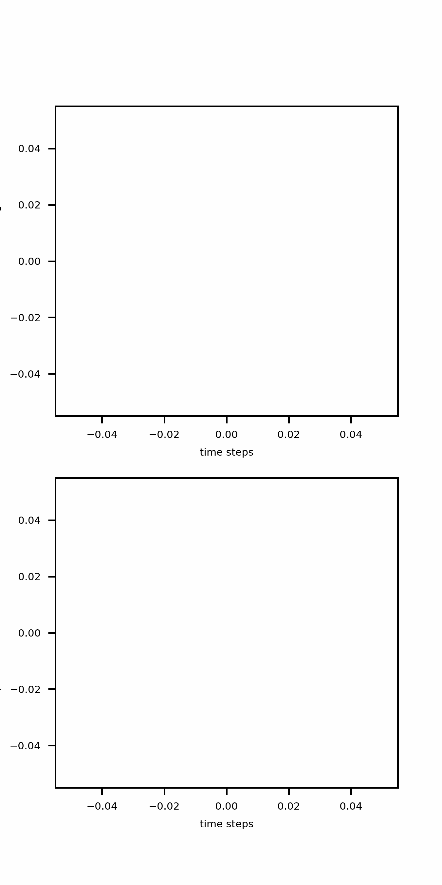
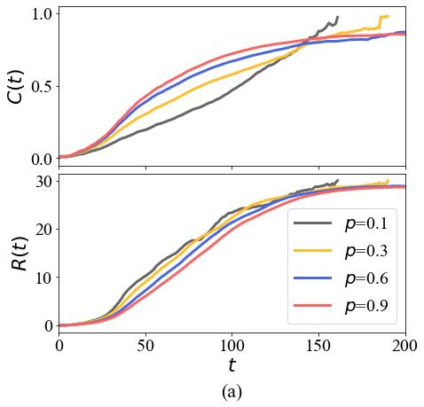
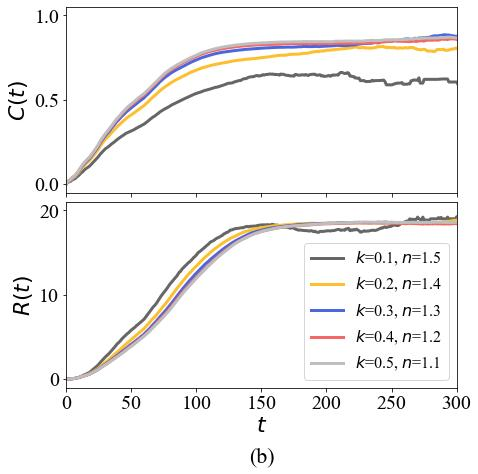

<div align="center">


# Complex Systems Modelling for Major Crime Incident Responses

</div>

## Introduction

Major crime incidents cover a larger area and last longer than regular
incidents. Gathering more information when police respond to these
incidents may resolve them faster, rather than soley relying on a fast
response. Information is the when and whereabouts of persons of interest
during an incident. An effective response therefore balances information 
gathering and response time. We build a computational model that captures 
the main dynamics of a real-world incident response and then simulate
multiple response movements to various incident scenarios.

Agent-based modelling is used to represent autonomous agent responders making pathing decisions on a graph road network. To guide them, we develop algorithms that combine the Inverted Ant Colony Optimisation and A* shortest path algorithms. These encourage agents to gather new information on short alternative paths relative to other agents en route to an incident.

<p float="left">
  
   
</p>

The first figure shows an illustration of agent path decision making. Paths (a) and (b) are the same distance. The responder sees path (b) as faster given the previous responder took path (a) and deposited pheromones (purple) which changed the landscape. The second figure shows an illustration of model components. Agent responders (blue) start at police station nodes (cyan). They traverse edges representing roads (black) on their way to the incident node (red). Only roads within the search radius (orange) have information points to be gathered by agents. As they traverse roads, they deposit pheromones (purple) on the edges. A darker shade indicates multiple traversals on that same edge.

<br />

## Installation

```shell
# get the code
git clone https://github.com/doodem/majorincident.git
cd majorincident

# setup virtual environment
python -m venv .venv
source .venv/bin/activate

# install dependencies
pip install -r requirements.txt
```

## Simulating Responses

There are two responses movements available:

* Simultanous (`default`): All responders are dispatched at the same time.
* Staggered (`staggered_dispatch=True`): Responders are dispatched at regular intervals.

There are three incident scenarios available (can be combined):

* Evolving (`evolving_incident=True`): A  major crime incident evolves over time. The search radius grows and information regenerates.
* Emerging (`emerging_incident=True`): The incident may be more serious than first thought. Responders priortise faster information gathering given the escalating situation.
* Spreading (`emerging_incident=True`): A major crime incident may spread to nearby areas. An additional incident appears within the search radius.

These movements and scenarios require other parameters which can be found using the above `prefixes_*`. Get help with `python ensemble.py --help`.

```Python
from majorincident import VoronoiGraphRoadNetwork, MajorCrimeIncidentResponse
%matplotlib widget

# build graph
graph_config = {
      'road_network_points': 150, 
      'station_positions': [[0.36, 0.40], [0.61, 0.58]],
      'cluster_number': 2,
      'cluster_points': 50,
      'cluster_size': 0.1
}

graph = VoronoiGraphRoadNetwork(graph_config, seed = 42)

# initalise model and choose a scenario
model = MajorCrimeIncidentResponse(
      world = graph,
      search_radius_size = 25,
      number_of_responders = 20,
      pheromone_deposit = 0.3,
      emerging_incident = True,
      emerging_incident_k = 0.2,
      emerging_incident_n = 1.5
)

# add measures
from majorincident import SearchRadiusCoverage, ResponderReachedIncident

model.add_instrument(SearchRadiusCoverage())
model.add_instrument(ResponderReachedIncident())

# run the model
model.run()
```

```Python
# show simulated response
model.sim()
```

```Python
# show animated results
model.animate_metrics()
```

<p float="left">
  
   
</p>

**_NOTE:_**  The incident node changes per simulation to explore the effect of the parameters. The search radius moves with the incident. Add a seed `np.random.seed()` to keep the same incident node.

**_NOTE:_**  Add your own graph using `networkx`. Ensure there is at least one node with attribute `station=True` and all nodes have `pos` positions. All edges must have a `dist` attribute representing the distance along that edge.

## Reproducing Results

To reproduce the reported results in the paper, you need to run ensemble simulations [ensemble.py](./ensemble.py).

There are three methods available:

* Total (`-m 1`): The average total results at the end of a response.
* Trajectory (`-m 2`): The trajectory of the results as measured by an average per time-step.
* Pareto (`-m 3`): The pareto front based on balancing response time and information gathering.

Descriptions of the instruments can be found at the end of [majorincident.py](./majorincident.py).

```shell
# show options
python ensemble.py --help

# run simulations
python ensemble.py -m 1 -r 50 --pheromone_deposit 0.1:1:0.1 -o 'results.csv' -s 42
```

```Python
import pandas as pd
import matplotlib.pyplot as plt
from majorincident import PlotResponse

# read ensemble data
ensemble_simulations = pd.read_csv('results.csv')

# plot responses
fig, ax = plt.subplots()
PlotResponse(ax=ax, data=ensemble_simulations, x='TimeStep', y='Avg_Covered', group='ModelNumber')
plt.show()
```

<p float="left">
  
   
</p>

## Citation

```
@article{Doody-Burras,
      title={Optimising Information Gathering of Autonomous Agents Following a Major Crime Incident}, 
      author={Doody-Burras, Mitchell and Algar, Shannon and Baily, Janelle and Small, Michael},
      journal={},
      year={}
}
```